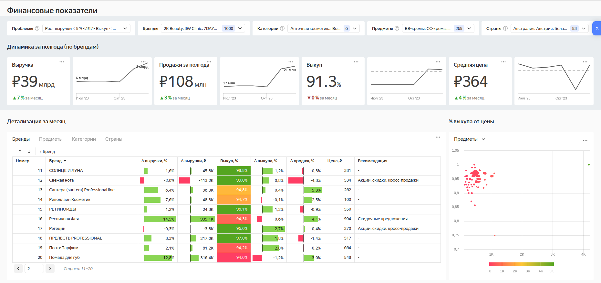
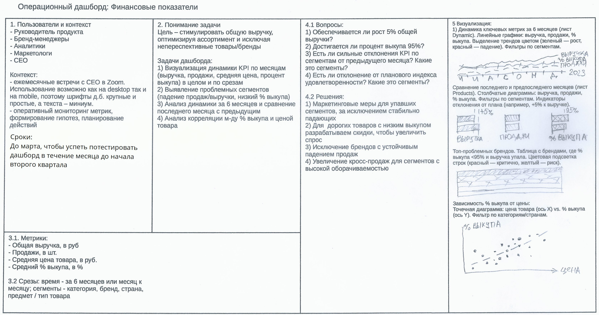

# Документация к Дашборду "Финансовые показатели"

## Введение

[Данный дашборд](https://datalens.yandex/drqc92vdz08yz) предназначен для комплексного анализа финансовых показателей брендов и ассортимента компании, работающей в сфере продаж товаров для красоты. Инструмент разработан для руководителей продуктовых команд, бренд-менеджеров, аналитиков и маркетологов, чтобы обеспечить прозрачность ключевых метрик, выявлять проблемные сегменты и формировать рекомендации по оптимизации ассортимента и маркетинговых активностей.

- [Исходный кейс (PDF)](Кейс_1_Финансовые_показатели.pdf)
- [Таблица с исходными данными (XLSX)](Данные_вариант_1.xlsx)

---

## Источники данных и структура

### Используемые данные

Дашборд построен на основе двух листов исходного файла Excel:

- **Dynamic** — содержит динамику финансовых метрик по брендам за последние полгода. Используется для раздела дашборда "Динамика за полгода (по брендам)".
- **Products** — содержит информацию по товарам (SKU, категория, предмет, бренд, цена, продажи, выручка, средний % выкупа, страна). Используется для визуализаций "Детализация за месяц" и "% выкупа от цены".

Объединение данных производится по полю `brand` с использованием inner join, что позволяет анализировать показатели как на уровне отдельных товаров, так и агрегировано по брендам и другим сегментам.

### Ключевые поля

- **SKU** — уникальный идентификатор товара
- **Категория, Предмет, Бренд, Страна**
- **Цена, Продажи, Выручка** (по месяцам)
- **Средний % выкупа** (по месяцам)

---

## Архитектура и логика дашборда

### Основные разделы

1. **Внешний вид**  
Ниже приведено изображение дашборда.

   

3. **Динамика за полгода (по брендам)**
   - Отображает ключевые метрики (выручка, продажи, средняя цена, % выкупа) в динамике за 6 месяцев.
   - Для визуализации используются 4 отдельных индикатора и 4 спарклайна, что позволяет корректно отображать показатели с разными шкалами Y и избегать наложения данных.
   - Данный подход был выбран вместо единого линейного графика, как предполагалось в канвасе, из-за ограничений системы визуализации (Yandex Datalens) и для повышения читаемости.

4. **Детализация за месяц (включая Топ-10 проблемных сегментов)**
   - Позволяет выявить сегменты с наибольшими отклонениями от целевых показателей.
   - Сегменты формируются на основании выбранного фильтра в селекторе "Проблемы" (см. ниже).
   - Для каждого сегмента отображаются агрегированные показатели и рекомендации.
   - Табличная визуализация с возможностью переключения между вкладками: Бренды, Предметы, Категории, Страны, SKU.
   - Для каждого сегмента отображаются ключевые метрики, а также сравнение с предыдущим месяцем (индикаторы "месяц к месяцу").
   - При клике на строку сегмента таблица детализируется до уровня SKU, что позволяет анализировать конкретные товары.

   > В результате анализа исходного датасета с помощью Python были определены четыре возможные иерархии: Бренд → SKU, Категория → SKU, Страна → SKU, Предмет → SKU. При этом между полями Бренд, Категория, Страна и Предмет существуют отношения многие-ко-многим, что не позволяет выстроить иерархии между ними. Исходя из этого, в таблице "Детализация за месяц" для каждой вкладки по сегменту реализована соответствующая иерархия, позволяющая детализировать данные до уровня SKU внутри выбранного сегмента. Кроме того, предусмотрена отдельная вкладка "SKU", которая не ограничена сегментами (за исключением влияния селекторов) и содержит максимально подробную информацию по каждому товару.

5. **% выкупа от цены**
   - График зависимости процента выкупа от средней цены товара.
   - Доступны вкладки по Брендам, Предметам, Категориям, Странам.
   - Вкладка по SKU недоступна из-за ограничения на количество точек (более 90 000 позиций превышают лимит системы).

---

## Селекторы и фильтрация

### Описание селекторов

- **Бренды** — влияет на все чарты дашборда, включая верхние метрики ("Динамика за полгода").
- **Проблемы** — особый селектор, реализующий ручное задание параметра для фильтрации данных уже после агрегации (см. ниже).
- **Категории, Предметы, Страны** — влияют только на чарты раздела "Детализация за месяц" и "% выкупа от цены".

> **Важно:** Чарты не влияют друг на друга и не изменяют состояние селекторов. Это решение принято для упрощения логики работы с дашбордом и повышения прозрачности анализа. Внутри раздела "Детализация за месяц" реализованы собственные переключатели по сегментам.

### Селектор "Проблемы"

Селектор "Проблемы" реализует фильтрацию данных **после агрегации**, что позволяет формировать топ-10 проблемных сегментов по сложным условиям, недоступным для стандартных селекторов (которые фильтруют данные до агрегации). Это ключевая особенность дашборда, позволяющая гибко анализировать проблемные зоны по следующим условиям:

- Рост выручки < 5 % и Выкуп < 95 %
- Рост выручки < 5 %
- Выкуп < 95 %
- Рост выручки < 5 % или Выкуп < 95 %
- Нет проблем
- Не выбрано (нет фильтра)

---

## Логика формирования рекомендаций

Поле **"Рекомендации"** вычисляется автоматически как для отдельных товаров (SKU), так и для сегментов (брендов, категорий и т.п.) на основании агрегированных показателей. Возможные значения:

1. **"Акции, скидки, кросс-продажи"** — если за последний месяц зафиксировано падение выручки.
2. **"Скидочные предложения"** — если выручка не падает, но % выкупа < 95% и товар входит в 20% самых дорогих.
3. **"Изъять из ассортимента"** — если выручка не падает, но % выкупа < 95% и товар входит в 20% товаров с самыми низкими продажами.
4. **"-"** — рекомендаций нет.

Логика полностью соответствует бизнес-требованиям, описанным в [кейсе](Кейс_1_Финансовые_показатели.pdf).

---

## Визуальные и технические особенности

- В ряде случаев визуализации были адаптированы по сравнению с исходным канвасом из-за ограничений Yandex Datalens:
  
  
    - Вместо единого графика динамики — отдельные индикаторы и спарклайны.
    - Сравнение метрик "месяц к месяцу" реализовано в таблице "Детализация за месяц" с помощью линейных индикаторов, что позволило объединить две визуализации в одну и повысить компактность.
- Для графика "% выкупа от цены" вкладка по SKU отключена из-за превышения лимита точек (более 75 000).

---

## Сценарии использования

1. **Мониторинг ключевых метрик**  
   Используйте верхний блок "Динамика за полгода" для отслеживания трендов по выручке, продажам, средней цене и % выкупа.

2. **Выявление проблемных сегментов**  
   С помощью селектора "Проблемы" определите топ-10 сегментов, требующих внимания, и ознакомьтесь с рекомендациями по каждому из них.

3. **Детализация и анализ**  
   Переключайтесь между вкладками "Детализация за месяц" для анализа по брендам, категориям, предметам, странам и отдельным товарам (SKU).

4. **Анализ зависимости % выкупа от цены**  
   Используйте соответствующий график для выявления ценовых сегментов с низким % выкупа и формирования гипотез по скидочным предложениям.

---

## Преимущества и уникальные особенности

- **Гибкая фильтрация проблемных сегментов** за счет селектора "Проблемы" с пост-агрегационной фильтрацией.
- **Автоматизированные рекомендации** для сегментов и товаров на основе бизнес-логики.
- **Интуитивная детализация** до уровня SKU с возможностью быстрого перехода между сегментами.
- **Адаптация визуализаций** под реальные ограничения BI-системы без потери информативности.
- **Единая точка доступа** к актуальным данным для всех заинтересованных подразделений компании.

---

## Заключение

Дашборд финансовых показателей — это современный инструмент для анализа эффективности ассортимента, выявления проблемных зон и поддержки принятия решений по развитию бизнеса. Его использование позволяет оперативно реагировать на изменения рынка, оптимизировать ассортимент и повышать финансовые результаты компании.

